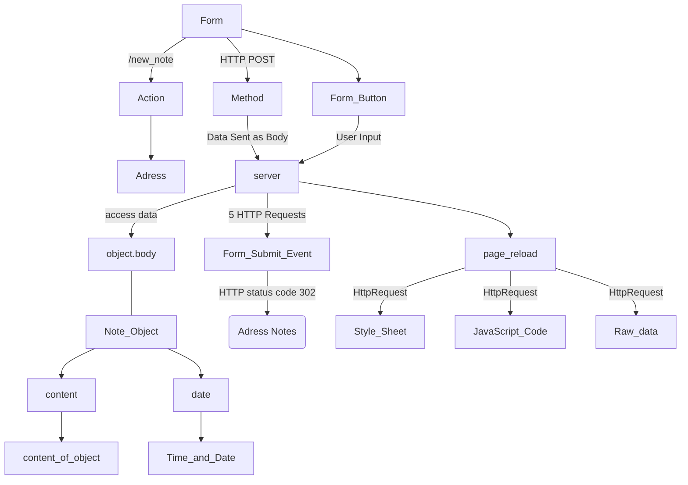

```mermaid
graph TD;
    Form--/new_note-->Action
    Action-->Adress
    Form--HTTP POST-->Method
    Method--Data Sent as Body-->server
    server--access data-->object.body
    object.body---Note_Object
    Note_Object-->content
    content-->content_of_object
    Note_Object-->date
    date-->Time_and_Date
    Form-->Form_Button
    Form_Button--User Input-->server;
    server--5 HTTP Requests-->Form_Submit_Event
    Form_Submit_Event--HTTP status code 302-->Location(Adress Notes)
    server-->page_reload
    page_reload--HttpRequest-->Style_Sheet
    page_reload--HttpRequest-->JavaScript_Code
    page_reload--HttpRequest-->Raw_data
```