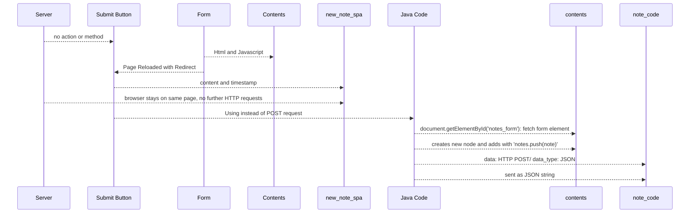

```mermaid
sequenceDiagram
    Server -->> Submit Button: no action or method
    Form -->> Contents: Html and Javascript
    Form -->> Submit Button: Page Reloaded with Redirect
    Submit Button -->> new_note_spa: content and timestamp
    Server -->> new_note_spa: browser stays on same page, no further HTTP requests
    Submit Button -->> Java Code: Using instead of POST request
    Java Code -->> contents: document.getElementById('notes_form'): fetch form element
    Java Code -->> contents: creates new node and adds with 'notes.push(note)'
    Java Code -->> note_code: data: HTTP POST/ data_type: JSON
    Java Code -->> note_code: sent as JSON string
```