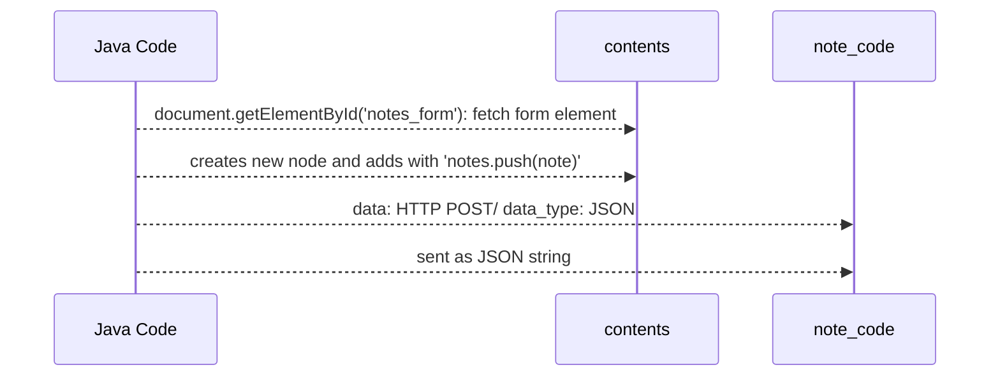

```mermaid
sequenceDiagram
Java Code -->> contents: document.getElementById('notes_form'): fetch form element
    Java Code -->> contents: creates new node and adds with 'notes.push(note)'
    Java Code -->> note_code: data: HTTP POST/ data_type: JSON
    Java Code -->> note_code: sent as JSON string

```